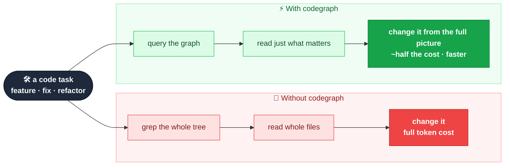
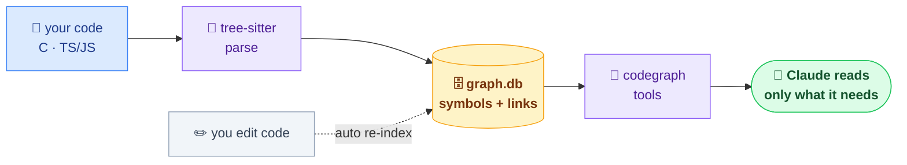
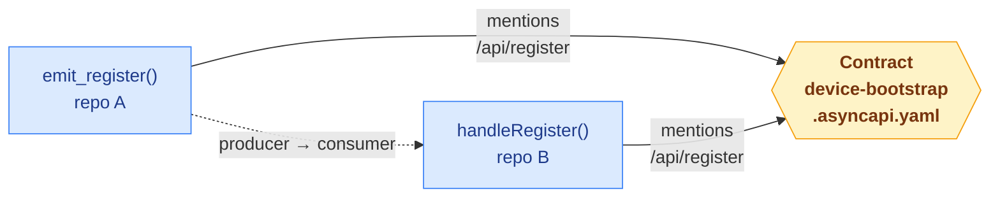

# codegraph

codegraph indexes your codebase into a structured graph of its symbols and how they
connect. It makes Claude a better **engineer** on your codebase — not just a better
search box: when it implements a feature, fixes a bug, or refactors, it works from the
full picture (every caller, the real blast radius, cross-repo wiring) instead of a
partial grep — so changes land in the right places. And it gets there reading **about
half as much** (≈40–60% fewer tokens in internal A/B testing), which also means
**faster, cheaper** turns. Everything stays local — the graph is just a file in your
workspace, nothing is uploaded. **Set it up once and forget it.**



## Contents
- [How it works](#how-it-works)
- [Languages](#languages)
- [Install](#install)
- [Index a workspace (once)](#index-a-workspace-once)
- [What Claude can do](#what-claude-can-do)
- [Cross-repo connections](#cross-repo-connections)
- [Roadmap](#roadmap)

## How it works



Tree-sitter parses your files into symbols and call sites and stores them in one
per-workspace SQLite file (`<workspace>/.codegraph/graph.db`). Calls resolve by name
within a repo; cross-repo links go through shared contracts (see
[Cross-repo connections](#cross-repo-connections)). It was built and tested on a real
four-repo workspace wired this way. Edits re-index a file at a time via hooks, so the
graph stays fresh without you touching it.

It's a static, name-based graph, so it's blind to function-pointer/callback dispatch and
string literals, and a C caller list is an upper bound (it can't see `#ifdef`s) — the
tools flag this so Claude verifies when it matters.

**Git is optional.** codegraph doesn't need it to work — it just walks the folder. When
git *is* present it uses it to spot what changed between sessions for cheap refreshes;
without it, codegraph still indexes everything and still re-indexes files as you edit
them.

## Languages

| Language | Status |
|---|---|
| C | ✅ supported |
| TypeScript / JavaScript | ✅ supported |
| Python | 🔜 planned |
| Go | 🔜 planned |
| Rust | 🔜 planned |
| Java | 🔜 planned |
| C++ | 🔜 planned |

## Install

Inside Claude Code, run these three lines — no compile step on mainstream platforms
(Linux/macOS/Windows × x64/arm64; the native bits are prebuilt and vendored):

```
/plugin marketplace add kaleLetendre/codegraph
/plugin install codegraph@codegraph
/reload-plugins
```

## Index a workspace (once)

Run once at the root of a **workspace** — a folder that can hold a single repo or many
side by side:

```
/codegraph-init
```

That's the whole job — **once per workspace**. It finds every repo under that root and
indexes them into one graph. (If your repos share an **AsyncAPI** contract spec, it also
links likely producers↔consumers across repos through it — a heuristic, opt-in extra.)
It keeps itself current as you edit (set and forget) for everyday work; after a big
refactor or mass rename, run `/codegraph-rebuild` once to resync. From then on just put
Claude to work — "add an endpoint that does X", "fix this bug", "refactor Y safely",
"what breaks if I change Z" — and it works from the graph instead of guessing from a
partial read.

Rarely needed: `/codegraph-status` (health), `/codegraph-rebuild` (after a big refactor),
`/codegraph-remove` (uninstall from a workspace).

## What Claude can do

| Tool | Answers |
|---|---|
| `find_symbol` | where something is defined |
| `get_source` | one symbol's body (not the whole file) |
| `trace_callees` / `trace_callers` | what it calls / who calls it — whole tree, one query |
| `trace_contract` / `path_between` | how code connects, across repos, via shared contracts |
| `query_sql` | read-only SQL for anything else |
| `graph_status` / `update_graph` | check freshness / refresh |

You don't call these — Claude does, automatically.

## Cross-repo connections

Within one repo, codegraph links calls by name. **Across** repos it won't guess by name
(a shared `start` in two repos would be a false link), so how it bridges depends on how
your repos actually connect.

### Services that talk over the wire (HTTP, queues)

A producer sends a message; a consumer in another repo handles it. There is **no
code-level call** between them — they share only the message *shape*. Code-only analysis
can't connect that, so codegraph bridges them through that shape, described as an
**AsyncAPI contract**.

**What you provide (opt-in):**

- A directory at the workspace root named `contracts`, `asyncapi`, or `*-contracts`
  (e.g. `api-contracts`) — or pass `--contracts <dir>`.
- Inside it, one or more **AsyncAPI 3.0** specs named `*.asyncapi.yaml` / `*.asyncapi.yml`
  (other files are ignored).
- Nothing if you don't have specs — no contracts dir simply means no cross-repo edges;
  everything else still works.

**What codegraph does with it:**

1. Reads each spec and extracts its *distinctive* wire tokens — channel/endpoint address
   paths (e.g. `/api/register`) and payload field names (e.g. `device_token`). Low-signal
   names (`id`, `type`, `status`, `data`, …) are filtered out so links stay meaningful.
2. Scans each symbol's body for those tokens; a hit adds a `REFERENCES` edge from that
   symbol to the Contract node.
3. When symbols in **different** repos reference the same token, it joins them
   producer→consumer, taking request/reply direction from the spec's operations.



It's a **heuristic** — "this code mentions a token this contract defines," not "verified
to implement it" — so link quality tracks how distinctive your endpoint/field names are.
Walk the seams with `trace_contract` and `path_between`.

### Packages that import each other in-process

In a monorepo where one package imports another, the link is right there in the code (the
`import` / `#include`). codegraph doesn't follow cross-repo imports yet — see the
[Roadmap](#roadmap).

## Roadmap

- **More languages** — Python, Go, Rust, Java, C++ (the 🔜 rows above); each is a grammar
  plus two small rules.
- **Cross-repo imports** — follow `import` / `#include` across packages, so in-process
  cross-repo links work without needing a contract.
- **Contract-free wire links** — optional matching on shared endpoint paths / field names,
  to connect services that talk over the wire even when there's no AsyncAPI spec.
